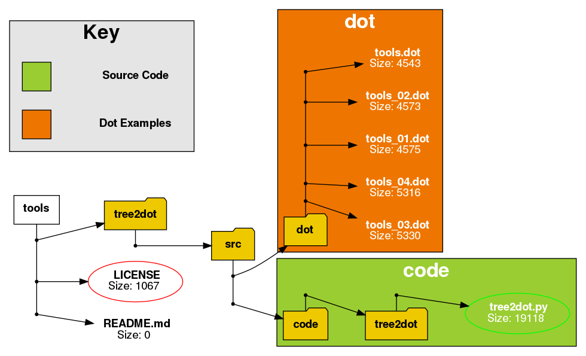

# "tools" Repo
## Overview
My tools repo is for assorted useful tools that I have created over the years.

## In the Repo

tree2dot.py A tool to create .dot representation of folder trees with plenty of options for customising the the resultant image. Intuitive command line to encourage rapid improvistation at the command line to get the results that you want. MIT licence.

